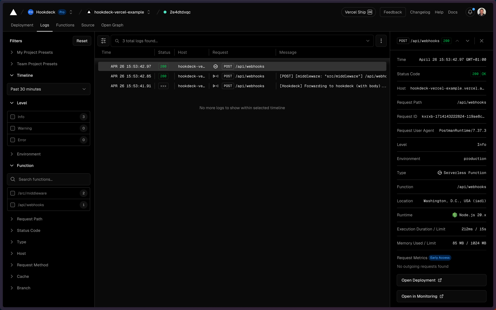
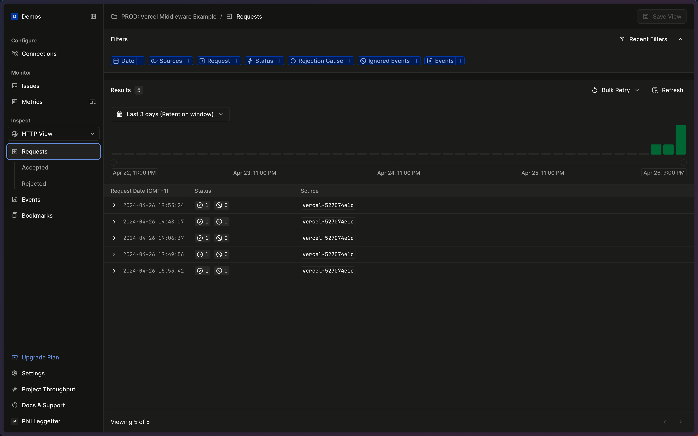
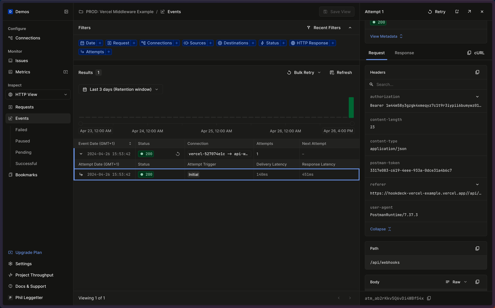

This application demonstrates using the [Hookdeck Vercel Middleware](https://github.com/hookdeck/hookdeck-vercel) within a [Next.js](https://nextjs.org/) project.

## Getting Started

- Create a [Vercel](https://vercel.com?ref=github-hookdeck-vercel) account and a project.
- Install the [Vercel CLI](https://vercel.com/docs/cli?ref=github-hookdeck-vercel)
- [Signup for a Hookdeck account](https://dashboard.hookdeck.com/signup?ref=github-hookdeck-vercel)

### Get the code

```bash
npx create-next-app -e https://github.com/hookdeck/hookdeck-vercel-example hookdeck-vercel-example
cd hookdeck-vercel-example
npm i
```

## Create your Vercel project

Use the Vercel CLI to set up a Vercel project.

```bash
vercel link
```

> Add a `--yes` flag if you want to skip the interactive options.
> ```bash
> vercel link --yes
> ```

## Set your Vercel project environment variables

Add `HOOKDECK_API_KEY` and `HOOKDECK_SIGNING_SECRET` (optional but recommended) as [environment variables](https://vercel.com/docs/projects/environment-variables?ref=github-hookdeck-vercel)
for your Vercel project.

Get the Hookdeck API key and Signing Secret from your [project secrets](https://dashboard.hookdeck.com/settings/project/secrets?ref=github-hookdeck-vercel).

```bash
vercel env add HOOKDECK_API_KEY production
vercel env add HOOKDECK_SIGNING_SECRET production
```

The above commands will prompt you for the values.

### Deploy your application

Deploy to the production environment:

```bash
vercel --prod
```

Within the output, you'll see your **Inspect** URL.

### Make an Asynchronous HTTP request

Click on the inspect URL and get your `{domain}.vercel.app` URL. Use that URL to make a request to your middleware endpoint:

```bash
curl --location 'https://{domain}}.vercel.app/api/webhooks' \
--header 'Content-Type: application/json' \
--data '{
    "test": "value"
}'
```

You will see output similar to the following:

```json
{
  "status": "SUCCESS",
  "message": "Request successfully handled. Request ID: req_nlwiPJSOTRFb6vHYlVez",
  "request_id": "req_nlwiPJSOTRFb6vHYlVez"
}
```

### Checkout the logs

The Vercel logs to see the middleware logging:



The Hookdeck request logs to see the inbound requests:



The Hookdeck event logs to see the generated events and event deliveries:



## Learn More

- [Hookdeck Vercel Middleware repo](https://github.com/hookdeck/hookdeck-vercel)
- [Hookdeck documentation](https://hookdeck.com/docs?ref=github-hookdeck-vercel-example)
- [Vercel Middleware documentation](https://vercel.com/docs/functions/edge-middleware?ref=github-hookdeck-vercel-example)
- [Next.js documentation](https://nextjs.org/docs?ref=github-hookdeck-vercel-example)

## Deploy on Vercel

[](https://vercel.com/new/clone?repository-url=https%3A%2F%2Fgithub.com%2Fhookdeck%2Fhookdeck-vercel-example&env=HOOKDECK_API_KEY,HOOKDECK_SIGNING_SECRET)
